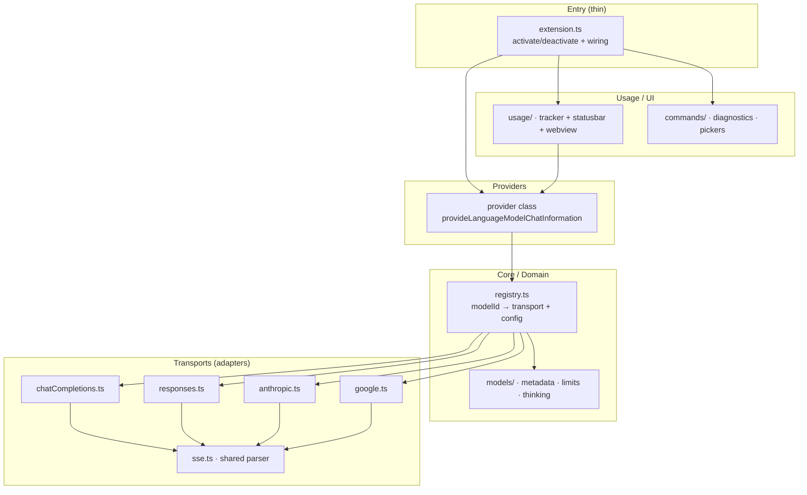

**Status:** 🟢 Active

# Provider Adapter Architecture — Multi-Vendor / Multi-Model Structure

**Topic:** architecture / provider / streaming / routing / maintainability / refactor
**Updated:** 2026-08-09
**Tags:** #architecture #provider #streaming #routing #refactor #adapter-pattern #strangler-fig #anti-regression
**Supersedes:** -

---

## Overview

This document captures the analysis and internet research performed on 2026-08-09 to answer one question: **what architecture and folder structure should this project use now that it must accommodate an ever-growing number of vendors and AI models, each with its own standards and behavior?**

The project already has god files. This document:

1. Diagnoses the current state with evidence from the codebase.
2. Summarizes research from authoritative sources (VS Code official docs, Vercel AI SDK, Continue, Cline, refactoring.guru, Martin Fowler).
3. Recommends a **Ports & Adapters + data-driven registry** architecture.
4. Proposes a **target folder structure** that stays lean.
5. Defines an **anti-regression contract** for adding new vendors/models.
6. Lays out a **phased Strangler Fig migration plan**.

Status: 🟢 Active — this is a living reference document. It is a proposal; implementation has not started yet. Timeline entries will be appended as phases are executed.

---

## 1. Current State Diagnosis (Evidence from Codebase)

The project is not flat-modular across the board. It has **three god files** that mix multiple concerns. Every other file (25 files, mostly <300 lines) is already lean and correctly flat-modular.

| File                    | Lines     | Mixed Concerns                                                                                                                                                       |
| ----------------------- | --------- | -------------------------------------------------------------------------------------------------------------------------------------------------------------------- |
| `src/extension.ts`      | **4,112** | Provider class (~1,083 lines), model-list fetch, constants, status bar, usage webview, tooltip SVG builder, commands, secret key handling, per-model thinking config |
| `src/streaming.ts`      | **1,686** | 4 transport streaming functions + 2 response extractors + think-tag filter + SSE parsing                                                                             |
| `src/goUsageTracker.ts` | **1,069** | Tracker core (~573 lines) + model pricing + SQLite history reader + UI formatting + quickpick builder                                                                |

### Why this is a problem

- **High blast radius**: adding or fixing one model family can touch `streaming.ts`, `routing.ts`, and `extension.ts` at the same time, increasing regression risk (visible across the `docs/issues/` history).
- **Not unit-testable at the seams**: VS Code officially recommends modular design so the deterministic parts (message conversion, chunk parsing, token estimation) can be unit-tested without a live model. God files make this hard.
- **Vendor onboarding friction**: every new transport/behavior becomes a diff inside already-huge files instead of a self-contained addition.

The core problem is **not** "flat vs folders" — it is that these 3 files mix too many domains. The fix must separate domains, not merely reorganize folders.

---

## 2. Research Findings (Authoritative Sources)

### 2.1 VS Code Official Docs — "Extension Anatomy" & "Language Model API"

- The entry file must stay **thin**: `activate`/`deactivate` should only do **wiring** (register commands, push disposables), not contain business logic.
- VS Code explicitly recommends: _"consider designing your extension code in a modular way to enable you to unit test the specific parts that can be tested."_ Because model interaction is nondeterministic, only the **deterministic parts** (message conversion, chunk parsing, token estimation) are testable — so those must be isolated as pure functions, separate from the streaming I/O wrappers.
- Takeaway for us: `extension.ts` should target <300 lines. Provider internals, model-list fetch, status bar, and webview belong in their own domains.

### 2.2 Vercel AI SDK — "Unified Provider Architecture" (most relevant reference)

The AI SDK solves **exactly our problem**: one core API, many providers with different wire formats (OpenAI, Anthropic, Google, etc.).

- **Single contract interface** `LanguageModelV4` with `doGenerate()` / `doStream()`.
- **One package per provider**: `@ai-sdk/openai`, `@ai-sdk/anthropic`, `@ai-sdk/google`, etc. Each implements three things:
  1. **Input mapping** — `convertToProviderMessages(prompt)` → provider-specific format.
  2. **Output mapping** — `createTransformer()` → SSE chunks converted to typed stream parts (text, reasoning, tool-call, finish, error).
  3. **Error standardization** — `APICallError`, `TooManyRequestsError` (with `isRetryable`) so client code never depends on which provider is in use.
- **`providerOptions`** — a mechanism for per-provider features without breaking the standard interface. This maps directly to our per-model thinking config (DeepSeek `max`, Qwen `thinking_budget`, MiniMax `on/off`, MiMo `low/med/high`).
- Takeaway for us: our `streaming.ts` already contains 4 transports + extractors, but in one file with shared internal state. The AI SDK pattern is **one adapter file per transport** with a common stream-part contract → `streaming.ts` shrinks from ~1,686 lines to ~4×300 independent, testable files.

### 2.3 Continue (open-source VS Code multi-provider extension) — real-world evidence

Actual structure under `core/llm/`:

```text
core/llm/
  llms/                  ← ONE FILE PER PROVIDER (anthropic.ts, openai.ts, gemini.ts, ...)
  countTokens.ts         ← shared helper
  fetchModels.ts         ← "unified dynamic model fetching for all providers"
  messages.ts            ← message conversion
  streamChat.ts          ← streaming core
  toolSupport.ts         ← tool schema
  openaiTypeConverters.ts
```

Confirms the proven pattern in the VS Code extension ecosystem: **shared helpers at the top level + one file per provider in a subfolder**.

### 2.4 Cline — `src/api/providers/`

Cline uses `src/api/providers/` with one file per provider, all implementing the same `ApiHandler` interface (`streamChat`, `getModels`, etc.). Client code talks to the interface, never to a concrete provider.

### 2.5 Design Patterns — Adapter (refactoring.guru) + Strangler Fig (Martin Fowler)

- **Adapter**: Single Responsibility + Open/Closed — "introduce new types of adapters without breaking existing client code." Exactly right for "add a new vendor without touching working code."
- **Strangler Fig**: do not big-bang rewrite. **Extract gradually per small component**, create _seams_ first, let old and new systems coexist. This is important because `streaming.ts` and `extension.ts` are sensitive areas with a long regression history.

---

## 3. Recommended Architecture: Ports & Adapters + Data-Driven Registry

Core principles (combining all findings, staying lean):

1. **Single contract (Port)** — one `ModelTransport` interface describing "one model call": `stream(request) → stream parts`, plus `buildRequest` and `parseChunk` as **pure functions**.
2. **One Adapter per transport** — chat-completions, responses, anthropic messages, google. Fully independent of each other.
3. **Data-driven registry** — routing is not scattered if-else but **one table**: `modelId → { transport, thinking config, context limit, capabilities }`. Adding a model = adding one row of data, not editing logic.
4. **Thin entry file** — `extension.ts` only does wiring + DI.
5. **Consistent error taxonomy** — all adapters throw errors from the existing `errors.ts` (`OpenCodeRequestError`) uniformly.
6. **Pure functions separated from I/O** — chunk parsers, message conversion, token estimation are pure and unit-testable (per VS Code's recommendation).



---

## 4. Target Folder Structure (Lean — max 2 subfolder depth)

Group by domain; keep depth shallow so it stays simple and not over-engineered.

```text
src/
  extension.ts                    # wiring only (target <300 lines)
  core/
    transport.ts                  # ModelTransport interface (port) + types
    registry.ts                   # modelId → transport + per-model config (data-driven)
  transports/
    chatCompletions.ts            # OpenAI chat adapter
    responses.ts                  # OpenAI Responses adapter
    anthropic.ts                  # Anthropic messages adapter
    google.ts                     # Gemini adapter
    sse.ts                        # pure SSE parser (unit-testable)
    streamParts.ts                # emit thinking/progress/text → vscode parts
  models/
    metadata.ts                   # live fetch + fallback snapshot (moved from extension.ts)
    limits.ts / capabilities.ts / thinking.ts   # per-model config (already exist, keep)
  usage/
    tracker.ts                    # core tracker (from goUsageTracker.ts)
    history.ts                    # SQLite read (from goUsageTracker.ts)
    formatting.ts                 # status bar text / tooltip / quickpick (from goUsageTracker.ts)
    webview.ts                    # usage webview (from extension.ts)
  commands/
    diagnostics.ts
    thinkingPicker.ts
    usageTargetEditor.ts
  auth/
    openCodeAuth.ts               # key resolution + BYOK (already exists)
  util/
    errors.ts / retry.ts / tokenEstimate.ts / chatParts.ts
    toolCallAccumulator.ts / imageNormalizer.ts
  contextWindow/
    contextWindowHook.ts / contextWindowHookBridge.ts
```

**Not everything must move.** Files that are flat and small (<300 lines) may stay where they are. Principle: _"do not move what is healthy."_

---

## 5. Anti-Regression Contract — Checklist for Adding a New Vendor/Model

After refactoring, this is the SOP so model additions have minimal risk:

1. Add one new transport adapter in `transports/` (implements `ModelTransport`).
2. Add one config row in `core/registry.ts` (`modelId → transport`, thinking config, limits, capabilities).
3. Add metadata in `models/metadata.ts` (live fetch + fallback snapshot — never remove the fallback).
4. Do **not** touch `extension.ts` for any of the above — only wire a new command if one is introduced.
5. Errors use the `errors.ts` taxonomy (`OpenCodeRequestError`), never raw throws.
6. Unit-test the pure parts of the adapter (parse chunk, convert message) without needing a `vscode` runtime.

---

## 6. Migration Strategy (Strangler Fig — recommended)

Extract in phases, lowest risk first, respecting our issue history. Never big-bang.

| Phase | Extraction                                                                                         | Risk         | Rationale                                                             |
| ----- | -------------------------------------------------------------------------------------------------- | ------------ | --------------------------------------------------------------------- |
| 1     | `goUsageTracker.ts` → `usage/tracker.ts` + `history.ts` + `formatting.ts`                          | Low          | No streaming/routing touch; mechanical refactor only (cut-paste-edit) |
| 2     | `extension.ts` → split status bar + webview + tooltip → `usage/webview.ts` + `usage/formatting.ts` | Low–Med      | UI separated from provider logic                                      |
| 3     | `streaming.ts` → `transports/*` (1 file per transport) + `sse.ts`                                  | **Med–High** | Sensitive area; do per-transport, test 1 model family each step       |
| 4     | `extension.ts` → split model-list fetch & constants → `models/` + `core/registry.ts`               | Med          | Registry becomes data-driven                                          |
| 5     | `extension.ts` → only wiring remains                                                               | Low          | Thin entry achieved                                                   |

Each phase gate: `npm run compile` must pass + a targeted test with at least 1 model family touched by the change.

---

## 7. Conclusion

- The core problem is not "missing folders" — it is that **3 files mix multiple domains**, causing a large blast radius on every model addition.
- The industry-proven pattern (AI SDK, Continue, Cline) is **one adapter per transport + a single contract interface + a data-driven registry + a thin entry file** — this answers both "simple and lean" and "minimal regression".
- Do not rewrite all at once — **Strangler Fig, phase by phase**, starting with the lowest-risk area (`goUsageTracker.ts` split).

---

## Timeline

| Date       | Status    | Change                                                                                                                                                                                                                                                                                                                                                                                           |
| ---------- | --------- | ------------------------------------------------------------------------------------------------------------------------------------------------------------------------------------------------------------------------------------------------------------------------------------------------------------------------------------------------------------------------------------------------ |
| 2026-08-09 | 🟢 Active | Initial research + analysis document created. Proposal only; no code changed.                                                                                                                                                                                                                                                                                                                    |
| 2026-08-14 | ✅ Done   | God-file split executed on `refactor/split-god-files` (usage/ · transports/ · provider/ · models/ · core/ · commands/); `extension.ts` 4653 → ~414 lines. See CHANGELOG `[Unreleased]`.                                                                                                                                                                                                          |
| 2026-08-14 | ✅ Done   | **Data-driven registry implemented** (`src/core/registry.ts`). `resolveModelRouting()` (transport) and `thinkingFamily()` both read the `MODEL_REGISTRY` table; `ModelEndpointKind` type moved to the registry. Scope note: context limits/capabilities stay metadata-driven (live models.dev) — not duplicated as a static table. The full `ModelTransport` port interface remains future work. |

---

## References

- VS Code — Extension Anatomy: <https://code.visualstudio.com/api/get-started/extension-anatomy>
- VS Code — Language Model API (Testing your extension / modularity): <https://code.visualstudio.com/api/extension-guides/language-model>
- Vercel AI SDK — Unified Provider Architecture: <https://ai-sdk.dev/docs/foundations/providers-and-models>
- Vercel AI SDK — Writing a Custom Provider (Language Model Specification V4): <https://ai-sdk.dev/providers/community-providers/custom-providers>
- Continue — `core/llm/` structure: <https://github.com/continuedev/continue/tree/main/core/llm>
- Cline — `src/api/providers/`: <https://github.com/cline/cline>
- refactoring.guru — Adapter: <https://refactoring.guru/design-patterns/adapter>
- Martin Fowler — Strangler Fig: <https://martinfowler.com/bliki/StranglerFigApplication.html>
